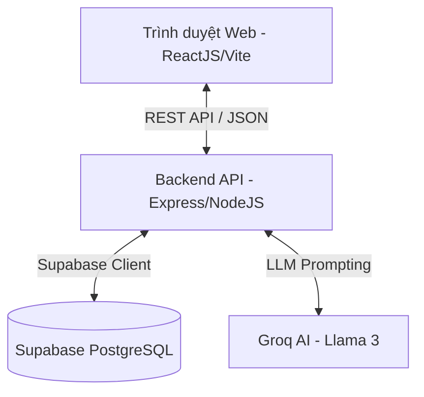

<div align="center">
  <h1 align="center">🏪 Sora POS V2</h1>
  <p align="center">
    <strong>Hệ thống quản lý bán hàng tại quầy (Point of Sale) Full-Stack với công nghệ AI</strong>
  </p>
  <p align="center">
    
    
    
    
    
    
  </p>
</div>

<hr/>

**Sora POS** là một hệ thống quản lý cửa hàng bán lẻ chuyên nghiệp được thiết kế theo cấu trúc Monorepo. Hệ thống không chỉ cung cấp giải pháp thanh toán tại quầy mượt mà, mà còn tích hợp bộ công cụ quản lý kho hàng mạnh mẽ với khả năng cảnh báo tồn kho tự động. Đặc biệt, Sora POS tích hợp trí tuệ nhân tạo (LLM qua **Groq API**) để tự động phân tích dữ liệu bán hàng và đưa ra gợi ý nhập hàng thông minh.

## ✨ Các tính năng nổi bật

- 🛒 **Bán hàng tại quầy (POS):** Giao diện bán hàng tối ưu, tìm kiếm sản phẩm bằng mã vạch, thanh toán nhanh chóng.
- 🔐 **Hệ thống Phân quyền (RBAC):** Cung cấp 3 cấp độ truy cập: `Admin`, `Manager`, và `Cashier`.
- 📦 **Quản lý Kho thông minh:** Theo dõi tồn kho thực tế, lưu vết lịch sử xuất nhập, thiết lập ngưỡng tồn kho tối thiểu.
- ⚠️ **Cảnh báo Tự động:** Tự động cảnh báo khi một sản phẩm sắp hoặc đã hết hàng.
- 🤖 **Trợ lý AI (Groq):** Đưa ra đề xuất số lượng cần nhập kho dựa trên tốc độ bán trung bình và mục tiêu duy trì hàng hóa, tự động tạo mô tả sản phẩm và tự động gán danh mục sản phẩm.
- 📊 **Dashboard & Báo cáo:** Cung cấp biểu đồ trực quan (Recharts) về doanh thu, xu hướng bán hàng, và danh sách sản phẩm bán chạy nhất.
- 🖨️ **Tạo và in Hóa đơn PDF:** Xuất hóa đơn chuyên nghiệp với hỗ trợ in khổ giấy K80.

---

## 🏗 Kiến trúc Hệ thống

Dự án được xây dựng theo kiến trúc Monorepo, giúp quản lý cả Frontend và Backend trong cùng một repository một cách dễ dàng.



### 💻 Frontend (ReactJS)
- **Framework:** React 19 + TypeScript, Build bằng Vite.
- **Styling:** Tailwind CSS.
- **State Management:** Zustand (Global State) & React Hook Form (Local Form State).
- **Validation:** Zod.

### ⚙️ Backend (NodeJS)
- **Framework:** Express + TypeScript.
- **Cơ sở dữ liệu:** Supabase (PostgreSQL).
- **Authentication:** JWT (JSON Web Tokens).
- **AI Integration:** Groq API SDK (Model: llama-3.1-8b-instant).

---

## 🚀 Hướng dẫn Cài đặt & Khởi chạy (Dành cho Người mới)

Hệ thống đã được thiết lập để có thể chạy toàn bộ dự án (cả Frontend lẫn Backend) chỉ bằng **một câu lệnh duy nhất**. Hãy làm theo các bước dưới đây:

### 1. Yêu cầu hệ thống
- **Node.js**: Phiên bản 22.x
- **Tài khoản Supabase**: Đăng ký miễn phí tại [supabase.com](https://supabase.com)
- **Groq API Key**: Lấy API Key miễn phí tại [console.groq.com](https://console.groq.com)

### 2. Thiết lập Cơ sở dữ liệu (Supabase)
1. Đăng nhập vào Supabase và tạo một Project mới.
2. Mở mục **SQL Editor** trong thanh công cụ bên trái.
3. Mở file `database/schema.sql` trong dự án này, copy toàn bộ nội dung và dán vào SQL Editor, sau đó nhấn **Run**.
4. Chạy tiếp `database/app_settings.sql`, `database/hardening.sql`, và `database/enterprise_pos_core.sql` để bật cấu hình vận hành, ràng buộc dữ liệu, transaction checkout/cancel và audit log.
5. (Tùy chọn) Để có dữ liệu mẫu ban đầu, tiếp tục copy và chạy nội dung file `database/seed.sql`. Lưu ý file này có xóa dữ liệu cũ, chỉ dùng cho database mới/demo.
6. Vào **Project Settings > API** để lấy `Project URL` và `service_role secret`.

### 3. Tải dự án và Cài đặt thư viện
Mở Terminal/Command Prompt và chạy các lệnh sau:

```bash
# Clone dự án về máy
git clone https://github.com/your-username/sora-pos.git
cd sora-pos

# Cài đặt toàn bộ thư viện cho cả thư mục gốc, frontend và backend
npm install
npm install --prefix frontend
npm install --prefix backend
```

### 4. Cấu hình biến môi trường (.env)

**Tại Backend (`backend/.env`):**
Tạo file `.env` trong thư mục `backend/` dựa trên file `.env.example`:

```env
PORT=3001
NODE_ENV=development
JWT_SECRET=thay-bang-chuoi-bi-mat-cua-ban
JWT_EXPIRES_IN=10h
SUPABASE_URL=https://<ID-CUA-BAN>.supabase.co
SUPABASE_SERVICE_ROLE_KEY=<SERVICE_ROLE_KEY-CUA-BAN>
GROQ_API_KEY=<GROQ-API-KEY-CUA-BAN>
CORS_ORIGIN=http://localhost:5173
```

**Tại Frontend (`frontend/.env`):**
Tạo file `.env` trong thư mục `frontend/` dựa trên file `.env.example`:

```env
VITE_API_URL=http://localhost:3001/api
VITE_APP_NAME=Sora POS
VITE_SUPABASE_URL=https://<ID-CUA-BAN>.supabase.co
VITE_SUPABASE_ANON_KEY=<ANON-KEY-CUA-BAN>
```

### 5. Khởi chạy Hệ thống

Từ thư mục gốc của dự án (`sora-pos/`), chỉ cần chạy lệnh sau:

```bash
npm run dev
```

Lệnh này sẽ khởi động cả Backend và Frontend cùng một lúc:
- **Frontend** sẽ mở tại: `http://localhost:5173`
- **Backend API** sẽ chạy tại: `http://localhost:3001`

---

## 👥 Tài khoản Đăng nhập (nếu đã chạy file seed.sql)

Nếu bạn đã chạy file `database/seed.sql`, bạn có thể đăng nhập bằng các tài khoản sau:

| Vai trò | Email / Mã đăng nhập | Mật khẩu | Quyền hạn |
| :--- | :--- | :--- | :--- |
| **Admin** | `admin@sorapos.com` | `password123` | Toàn quyền quản trị hệ thống, cài đặt, phân quyền |

> File `database/seed.sql` hiện chỉ tạo 3 vai trò và 1 tài khoản admin mặc định. Các tài khoản Manager/Cashier nên được tạo trong màn hình Nhân viên sau khi đăng nhập admin.

---

## 🤖 Cơ chế Trí tuệ Nhân tạo (AI)

Hệ thống cung cấp một module thông minh độc lập (`ai.service.ts`), sử dụng mô hình ngôn ngữ lớn để xử lý dữ liệu của cửa hàng:

1. **AI Khuyến nghị Nhập hàng:**
   Phân tích tốc độ bán trung bình trong 30 ngày qua và lượng tồn kho hiện tại để tính toán số lượng hàng cần nhập thêm, mục tiêu là để phủ đủ hàng bán trong 14 ngày tiếp theo (hoặc cấu hình tùy chỉnh). AI sẽ đưa ra thêm văn bản Insight giải thích chiến lược bằng Tiếng Việt.

2. **Cơ chế Fallback An toàn:**
   Trong trường hợp Groq API gặp sự cố hoặc bạn chưa điền `GROQ_API_KEY`, hệ thống vẫn tiếp tục hoạt động trơn tru dựa trên một bộ quy tắc cục bộ (Local Fallback Rules) sử dụng từ khóa mồi và toán học thuần túy.

---

## 📄 Giấy phép (License)

Dự án này được cấp phép theo tiêu chuẩn **MIT License**. Bạn có toàn quyền sử dụng, sao chép, thay đổi, và phân phối dự án với mục đích cá nhân hoặc thương mại.

---
*Phát triển với ❤️ bởi đội ngũ Sora POS*


## AI Barcode Scanning & Cashier Shift Management

- Fully integrated keyless barcode search logic with iCheck fallback scan checking.
- Designed automated role-based shifts logs, checkout bank transfer VietQR receipts.

