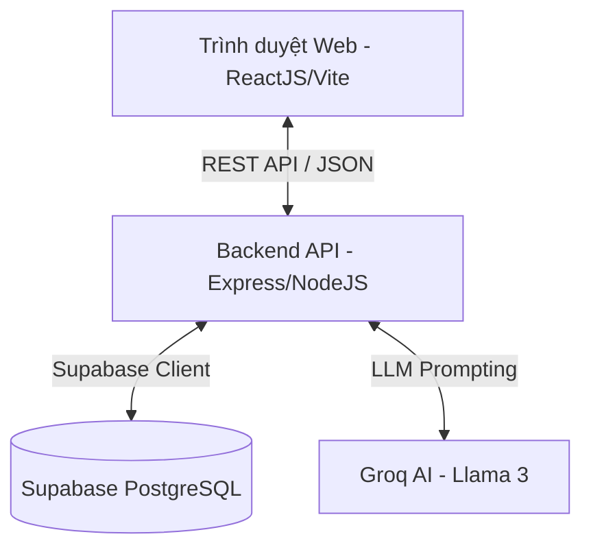

<div align="center">
  <h1 align="center">🏪 POS Bán hàng tích hợp quản lý kho hàng và cảnh báo tồn kho thấp</h1>
  <p align="center">
    <strong>Đề tài xây dựng hệ thống POS trên nền tảng web dành cho cửa hàng bán lẻ</strong>
  </p>
  <p align="center">
    
    
    
    
    
    
  </p>
</div>

<hr/>

**POS Bán hàng tích hợp quản lý kho hàng và cảnh báo tồn kho thấp** là hệ thống hỗ trợ cửa hàng bán lẻ thực hiện giao dịch tại quầy và kiểm soát hàng hóa trên cùng một nền tảng. Mỗi giao dịch bán hàng được liên kết với dữ liệu kho: khi đơn hàng hoàn tất, số lượng sản phẩm được cập nhật; khi hàng được nhập hoặc đơn hàng bị hủy, tồn kho được điều chỉnh theo nghiệp vụ tương ứng.

Trọng tâm của đề tài là ba thành phần có quan hệ trực tiếp với nhau:

1. **Bán hàng tại quầy:** lập đơn, quét mã vạch, tính tiền, ghi nhận thanh toán và xuất hóa đơn.
2. **Quản lý kho hàng:** theo dõi số lượng tồn, nhập hàng, điều chỉnh kho và lưu lịch sử biến động.
3. **Cảnh báo tồn kho thấp:** so sánh lượng hàng còn lại với ngưỡng tối thiểu của từng sản phẩm để cảnh báo kịp thời.

Các chức năng quản lý khách hàng, nhà cung cấp, nhân viên, ca làm việc, khuyến mãi, báo cáo và phân tích dữ liệu được xây dựng để hỗ trợ quy trình cốt lõi nêu trên. Trong nội dung báo cáo, tên đề tài được sử dụng thống nhất là **“POS Bán hàng tích hợp quản lý kho hàng và cảnh báo tồn kho thấp”**.

## 🎯 Mục tiêu và phạm vi cốt lõi

- Đồng bộ dữ liệu giữa bán hàng, thanh toán, hóa đơn và tồn kho.
- Tự động cập nhật tồn kho khi phát sinh giao dịch bán hàng, nhập hàng, hủy đơn hoặc điều chỉnh kho.
- Thiết lập ngưỡng tồn kho tối thiểu riêng cho từng sản phẩm và phát sinh cảnh báo khi chạm ngưỡng.
- Cung cấp dữ liệu doanh thu, lợi nhuận và tình trạng hàng hóa để hỗ trợ quản lý cửa hàng.
- Phân quyền ba nhóm người dùng: `Admin`, `Manager` và `Cashier`.
- Phân tích dữ liệu và đề xuất nhập hàng chỉ đóng vai trò hỗ trợ; quyết định cuối cùng thuộc về người quản lý.

## ✨ Các tính năng nổi bật

- 🛒 **Bán hàng tại quầy:** Tìm kiếm hoặc quét mã vạch, lập đơn hàng, áp dụng khuyến mãi, tính tiền và ghi nhận thanh toán.
- 📦 **Quản lý kho hàng:** Quản lý phiếu nhập, lịch sử nhập - xuất, điều chỉnh kho và số lượng tồn của từng sản phẩm.
- ⚠️ **Cảnh báo tồn kho thấp:** Theo dõi ngưỡng tồn tối thiểu và cảnh báo sản phẩm sắp hết hoặc đã hết hàng.
- 💳 **Thanh toán và hóa đơn:** Hỗ trợ tiền mặt, chuyển khoản, thẻ, VietQR và xuất hóa đơn PDF khổ K80.
- 🏷️ **Quản lý dữ liệu bán lẻ:** Quản lý sản phẩm, danh mục, khuyến mãi, khách hàng và nhà cung cấp.
- 👥 **Nhân viên và ca làm việc:** Phân quyền `Admin`, `Manager`, `Cashier`; theo dõi mở ca, đóng ca và đối chiếu tiền tại quầy.
- 📊 **Báo cáo kinh doanh:** Thống kê doanh thu, lợi nhuận, xu hướng bán hàng và sản phẩm bán chạy.
- 🤖 **Phân tích dữ liệu hỗ trợ:** Phân tích doanh thu, tồn kho và đề xuất lượng hàng cần nhập dựa trên dữ liệu lịch sử.

---

## 🏗 Kiến trúc hệ thống

Dự án được tổ chức theo cấu trúc Monorepo, gồm ứng dụng web, dịch vụ API, cơ sở dữ liệu và ứng dụng hỗ trợ quét mã vạch. Luồng xử lý chính đi từ giao dịch POS đến cập nhật kho, kiểm tra ngưỡng tồn và tổng hợp báo cáo.


```mermaid
graph TD
    Client[Trình duyệt Web - ReactJS/Vite]
    API[Backend API - Express/NodeJS]
    DB[(Supabase PostgreSQL)]
    AI[Groq AI - Llama 3]
    
    Client <-->|REST API / JSON| API
    API <-->|Supabase Client| DB
    API <-->|LLM Prompting| AI
```

### 💻 Frontend (ReactJS)
- **Framework:** React 19 + TypeScript, Build bằng Vite.
- **Styling:** Tailwind CSS.
- **State Management:** Zustand (Global State) & React Hook Form (Local Form State).
- **Validation:** Zod.

### ⚙️ Backend (NodeJS)
- **Framework:** Express + TypeScript.
- **Cơ sở dữ liệu:** Supabase (PostgreSQL).
- **Authentication:** JWT (JSON Web Tokens).
- **AI Integration:** Groq API SDK (Model: llama-3.1-8b-instant).

---

## 🚀 Hướng dẫn Cài đặt & Khởi chạy (Dành cho Người mới)

Hệ thống đã được thiết lập để có thể chạy toàn bộ dự án (cả Frontend lẫn Backend) chỉ bằng **một câu lệnh duy nhất**. Hãy làm theo các bước dưới đây:

### 1. Yêu cầu hệ thống
- **Node.js**: Phiên bản 22.x
- **Tài khoản Supabase**: Đăng ký miễn phí tại [supabase.com](https://supabase.com)
- **Groq API Key**: Lấy API Key miễn phí tại [console.groq.com](https://console.groq.com)

### 2. Thiết lập Cơ sở dữ liệu (Supabase)
1. Đăng nhập vào Supabase và tạo một Project mới.
2. Mở mục **SQL Editor** trong thanh công cụ bên trái.
3. Mở file `database/schema.sql` trong dự án này, copy toàn bộ nội dung và dán vào SQL Editor, sau đó nhấn **Run**.
4. Chạy tiếp `database/app_settings.sql`, `database/hardening.sql`, `database/enterprise_pos_core.sql`, và `database/stock_atomic_rpc.sql` để bật cấu hình vận hành, ràng buộc dữ liệu, transaction checkout/cancel, transaction kho và audit log.
5. (Tùy chọn) Để có dữ liệu mẫu ban đầu, tiếp tục copy và chạy nội dung file `database/seed.sql`. Lưu ý file này có xóa dữ liệu cũ, chỉ dùng cho database mới/demo.
6. Vào **Project Settings > API** để lấy `Project URL` và `service_role secret`.

### 3. Tải dự án và Cài đặt thư viện
Mở Terminal/Command Prompt và chạy các lệnh sau:

```bash
# Clone dự án về máy
git clone https://github.com/your-username/sora-pos.git
cd sora-pos

# Cài đặt toàn bộ thư viện cho cả thư mục gốc, frontend và backend
npm install
npm install --prefix frontend
npm install --prefix backend
```

### 4. Cấu hình biến môi trường (.env)

**Tại Backend (`backend/.env`):**
Tạo file `.env` trong thư mục `backend/` dựa trên file `.env.example`:

```env
PORT=3001
NODE_ENV=development
JWT_SECRET=thay-bang-chuoi-bi-mat-cua-ban
JWT_EXPIRES_IN=10h
SUPABASE_URL=https://<ID-CUA-BAN>.supabase.co
SUPABASE_SERVICE_ROLE_KEY=<SERVICE_ROLE_KEY-CUA-BAN>
GROQ_API_KEY=<GROQ-API-KEY-CUA-BAN>
CORS_ORIGIN=http://localhost:5173
```

**Tại Frontend (`frontend/.env`):**
Tạo file `.env` trong thư mục `frontend/` dựa trên file `.env.example`:

```env
VITE_API_URL=http://localhost:3001/api
VITE_APP_NAME=POS bán hàng
VITE_SUPABASE_URL=https://<ID-CUA-BAN>.supabase.co
VITE_SUPABASE_ANON_KEY=<ANON-KEY-CUA-BAN>
```

### 5. Khởi chạy Hệ thống

Từ thư mục gốc của dự án (`sora-pos/`), chỉ cần chạy lệnh sau:

```bash
npm run dev
```

Lệnh này sẽ khởi động cả Backend và Frontend cùng một lúc:
- **Frontend** sẽ mở tại: `http://localhost:5173`
- **Backend API** sẽ chạy tại: `http://localhost:3001`

---

## 👥 Tài khoản Đăng nhập (nếu đã chạy file seed.sql)

Nếu bạn đã chạy file `database/seed.sql`, bạn có thể đăng nhập bằng các tài khoản sau:

| Vai trò | Email / Mã đăng nhập | Mật khẩu | Quyền hạn |
| :--- | :--- | :--- | :--- |
| **Admin** | `admin@sorapos.com` | `password123` | Toàn quyền quản trị hệ thống, cài đặt, phân quyền |

> File `database/seed.sql` hiện chỉ tạo 3 vai trò và 1 tài khoản admin mặc định. Các tài khoản Manager/Cashier nên được tạo trong màn hình Nhân viên sau khi đăng nhập admin.

---

## 🤖 Phân tích dữ liệu và hỗ trợ nhập hàng

Đây là chức năng hỗ trợ mở rộng, không thay thế nghiệp vụ POS, quản lý kho hoặc quyết định của người quản lý. Module `ai.service.ts` sử dụng dữ liệu của cửa hàng và mô hình ngôn ngữ qua Groq API để tạo nội dung phân tích:

1. **Đề xuất nhập hàng:**
   Phân tích tốc độ bán trung bình trong 30 ngày và lượng tồn hiện tại để đề xuất số lượng cần nhập cho khoảng thời gian mục tiêu, mặc định là 14 ngày.

2. **Phân tích doanh thu và tồn kho:**
   Tổng hợp dữ liệu bán hàng, doanh thu, lợi nhuận, hàng tồn và cảnh báo để tạo nhận xét hỗ trợ người quản lý.

3. **Cơ chế dự phòng:**
   Khi Groq API không khả dụng hoặc chưa cấu hình `GROQ_API_KEY`, các nghiệp vụ bán hàng, cập nhật kho và cảnh báo tồn kho vẫn hoạt động. Một số đề xuất cơ bản được tính bằng quy tắc cục bộ.

---

## 📄 Giấy phép (License)

Dự án này được cấp phép theo tiêu chuẩn **MIT License**. Bạn có toàn quyền sử dụng, sao chép, thay đổi, và phân phối dự án với mục đích cá nhân hoặc thương mại.

---
*Phát triển MaiTam Developer*

## Quét mã vạch và quản lý ca thu ngân

- Hỗ trợ tìm kiếm sản phẩm bằng mã vạch và ứng dụng quét mã đi kèm.
- Ghi nhận ca làm việc theo vai trò, giao dịch tại quầy và thanh toán chuyển khoản qua VietQR.

## Ghi chú cập nhật cơ sở dữ liệu

Đối với database Supabase mới hoặc đã tồn tại, xem thứ tự migration đầy đủ tại [`database/README.md`](database/README.md). Không tự ý đổi thứ tự, đặc biệt với các RPC kho, lô/HSD, chính sách nhập hàng và vòng đời PO.

Các migration lõi lưu giá vốn tại thời điểm bán, bảo vệ transaction checkout/nhập kho, bật RLS và lưu kết quả phân tích doanh thu/tồn kho. `seed.sql` chỉ chạy trên database demo mới.

